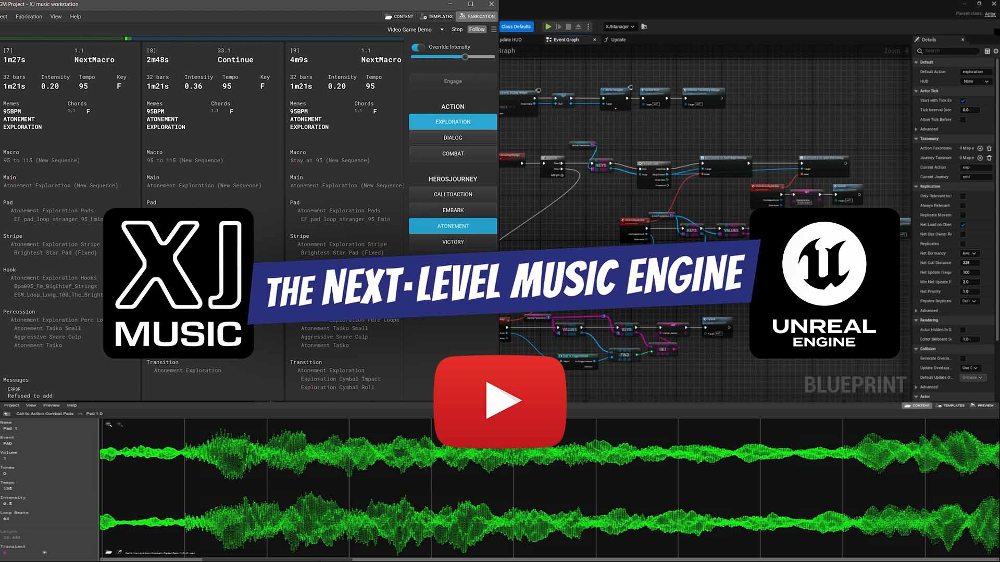

[](https://github.com/xjmusic/UnrealPlugin/actions/workflows/distribution.yml)
<br/>
<a href="https://xjmusic.com/license"></a>
<a href="https://discord.xj.io/"></a>
<a href="https://www.unrealengine.com/"></a>
<a href="https://github.com/insthync/awesome-unreal#sound"></a>
# Unreal Plugin for XJ music

<a href="https://www.youtube.com/watch?v=cs4DdL3jMI0">

</a>


# Adaptive music engine

[XJ music](https://xjmusic.com) is the first end-to-end solution for adaptive music in video games built specifically and only for music, enabling composers to realize new possibilities.

XJ includes
- [XJ music workstation](https://github.com/xjmusic/xjmusic/tree/main/workstation/README.md), a desktop DAW dedicated to preparing adaptive video game music
- [XJ music engine](https://github.com/xjmusic/xjmusic/tree/main/engine/README.md) in C++ to integrate the product within any game audio system.
- [XJ music Unreal plugin](https://github.com/xjmusic/UnrealPlugin/) to integrate the XJ music engine into [Unreal Engine](https://www.unrealengine.com/)

Download and install the XJ music workstation on your computer to start creating adaptive music for video games. The latest version of the XJ music workstation can be downloaded from [xjmusic.com/download](https://xjmusic.com/download).


Setup
----------------------

_**You need to have installed at least the 3.24 version of [Cmake](https://cmake.org/download/)**_

Open XJMusicPlugin and run one of the following commands based on your operating system:

### Windows
Run ```Setup.bat```

### Linux and MacOS
Run ```Setup.sh```

After the setup commands are completed, you can generate an Unreal Engine example project using 5 or 4 engine versions.

Run Examples
----------------------
_**To run the example you need to have installed Unreal Engine 5.4 or higher**_

You only need to copy an XJMusicPlugin folder and paste it inside the Plugins folder of the example project you selected:

The path to where you need to paste the plugin must look like this:
```Examples/../Plugins```


## Getting started

First, [Download the XJ music workstation](https://xjmusic.com/download) and follow the [installation instructions](https://docs.xjmusic.com/installation/).

Then, read the [getting started documentation](https://docs.xjmusic.com/getting-started/) which will show you how to create one of our Demo projects to get started checking out the workstation right away.

The source files for the demos are hosted [here](https://github.com/xjmusic/xjmusic-demos)

When you're ready to integrate XJ music into your game, check out the [C++ playback engine](https://github.com/xjmusic/xjmusic/tree/main/engine/) and [its documentation](https://engine-docs.xjmusic.com/).


## Plans for Audio Streaming

Read the [Audio Streaming design document"](Design/AssetStreaming-PetroStasiv.pdf) by [Petro Stasiv](https://www.linkedin.com/in/petro-stasiv/).


## Patented technology, open source codebase

The underlying technology is protected by [U.S. Patent 10,446,126](https://patents.google.com/patent/US10446126B1/)
You may use the XJ music engine completely free for projects with a budget under $250K.
For larger projects, contact licensing@xjmusic.com for a license.


## Community and contributing

XJ music is an ever-growing community of users and developers.

The best way to get in touch with the core engine developers is to join the
[XJ music Discord](https://discord.xj.io).

To get started contributing to the project, see the [contributing guide](CONTRIBUTING.md).
This document also includes guidelines for reporting bugs.

### Earning Equity in XJ music

All contributors to XJ music, including founder, director of engineering, and lead developer Charney Kaye, earn equity in the company based on the following formula: 1 hour of labor = 1 point of equity. Developers report all hours against specific Pull Requests. If you would like to contribute to the XJ music codebase and earn equity in the company, prepare your code in a Pull Request and [contact us](https://xjmusic.com/contact-us/) with a log of your hours corresponding to that work. If your pull request is accepted and merged into the main branch, we'll sign a contract guaranteeing your share of future revenue.


